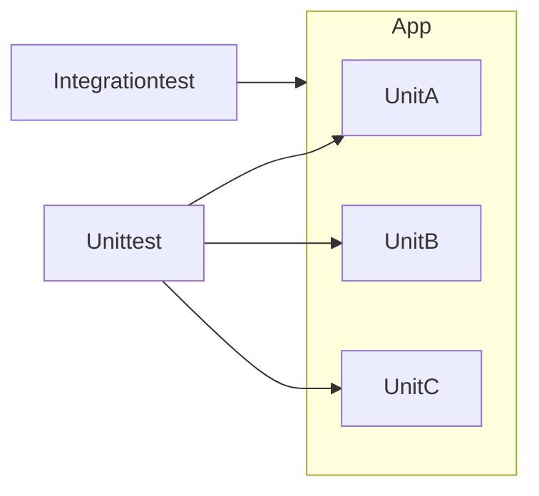

# Testing with Python

## Static

* mypy
* flake8

* ruff (https://github.com/astral-sh/ruff)
* pyright (https://github.com/microsoft/pyright, https://github.com/detachhead/basedpyright)
* pylyzer (https://github.com/mtshiba/pylyzer)

## Unit Testing

* unittest
    * verifying assumptions
    * code documentation
    * happy paths
    * unhappy paths
    * mocking
    * coverage

## Formatting

* autopep8 (https://github.com/hhatto/autopep8)
* black (https://black.readthedocs.io/en/stable/index.html)
* ruff (https://github.com/astral-sh/ruff)

## interop validation

* https://github.com/keleshev/schema
* roundtrip

## integration testing

## pipelines/workflows

* gitlab pipelines
    * https://gitlab.com/elsamuko/linuxtag_2024_python/-/pipelines
* github workflows
    * https://github.com/elsamuko/linuxtag_2024_python/actions

## Optional

* https://github.com/astral-sh/uv
